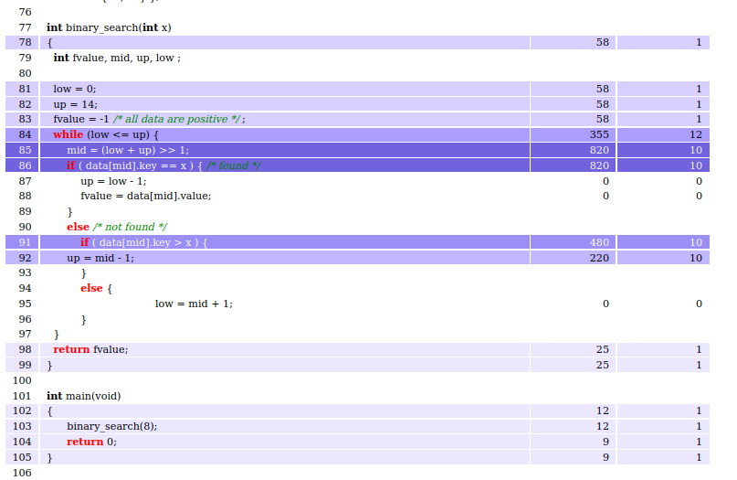

# Récupérer le code source avec statistique

Retourne un html du code source indiqué par `$fichier_source` avec les stats du nombre de passages et du temps passé par instruction. Avec le paramètre color_by, on peut indiquer si on veut que les lignes de code soit colorié selon le nombre de passages (`count`, valeur par défaut) ou le temps passé (`time`).





[TOC]

## Requête

**Méthode** : `Get`

```http
http://127.0.0.1:8000/stats/code/{$fichier_source}
```


## Paramètres

### Path

| Paramètre      | Type   | Requis | Description                                        |
| -------------- | ------ | ------ | -------------------------------------------------- |
| fichier_source | string | True   | Nom du fichier source dont on veut la colorisation |

### Query

| Paramètre  | Type   | Requis | Valeurs                | Description                                                  |
| ---------- | ------ | ------ | ---------------------- | ------------------------------------------------------------ |
| colored_by | string | False  | count (default) / time | Choix indiquant si le code source sera colorié en fonction des stictiques du temps d'exécution ou du nombre d'exécution |


## Réponse 

- Succès

| Code     | Content-Type               | Body                                      |
| -------- | -------------------------- | ----------------------------------------- |
| `200 Ok` | `text/html; charset=utf-8` | Html du code avec les statistique associé |


## Exemple

***Requête***

```http
http://127.0.0.1:8000/stats/code/bs.c?colored_by=count
```

**Résultat**

- Code : `200 OK`
- Content-type : `text/html; charset=utf-8`
- Body :   
```html
  <html><head><title>bs.c colored for ipet-total_count</title>
    <style>
        td {
            text-align: right;
            padding-left: 8pt;
            padding-right: 8pt;
        }
        td.source {
            text-align: left;
        }
        table {
            margin-top: 1em;
        }
    </style>

        
    <script type="text/javascript">
            var labels = ['ipet-total_time', 'ipet-total_count', ];
        var backgrounds = ['#ffffff', '#eae7ff', '#d6cfff', '#c0b7ff', '#ab9eff', '#a194fa', '#9b8ef5', '#8c7ded', '#7b6ce3', '#7162dd'];
        var foregrounds = ['#000000', '#000000', '#000000', '#000000', '#000000', '#ffffff', '#ffffff', '#ffffff', '#ffffff', '#ffffff'];

        function colorize(backs, label) {
            document.getElementById("label").textContent = label;
            trs = document.getElementById("stats").getElementsByTagName("tr");
            for(i = 0; i < trs.length; i++) {
                trs[i].style.backgroundColor = backgrounds[backs[i]];
                trs[i].style.color = foregrounds[backs[i]];
            }
        }

                var s0 = [
            0,
            0,
            0,
            0,
            0,
            0,
            0,
            0,
            0,
            0,
            0,
            0,
            0,
            0,
            0,
            0,
            0,
            0,
            0,
            0,
            0,
            0,
            0,
            0,
            0,
            0,
            0,
            0,
            0,
            0,
            0,
            0,
            0,
            0,
            0,
            0,
            0,
            0,
            0,
            0,
            0,
            0,
            0,
            0,
            0,
            0,
            0,
            0,
            0,
            0,
            0,
            0,
            0,
            0,
            0,
            0,
            0,
            0,
            0,
            0,
            0,
            0,
            0,
            0,
            0,
            0,
            0,
            0,
            0,
            0,
            0,
            0,
            0,
            0,
            0,
            0,
            0,
            0,
            2,
            0,
            0,
            2,
            2,
            2,
            4,
            9,
            9,
            0,
            0,
            0,
            0,
            6,
            3,
            0,
            0,
            0,
            0,
            0,
            1,
            1,
            0,
            0,
            1,
            1,
            1,
            1,
            0,
        ];
        var s1 = [
            0,
            0,
            0,
            0,
            0,
            0,
            0,
            0,
            0,
            0,
            0,
            0,
            0,
            0,
            0,
            0,
            0,
            0,
            0,
            0,
            0,
            0,
            0,
            0,
            0,
            0,
            0,
            0,
            0,
            0,
            0,
            0,
            0,
            0,
            0,
            0,
            0,
            0,
            0,
            0,
            0,
            0,
            0,
            0,
            0,
            0,
            0,
            0,
            0,
            0,
            0,
            0,
            0,
            0,
            0,
            0,
            0,
            0,
            0,
            0,
            0,
            0,
            0,
            0,
            0,
            0,
            0,
            0,
            0,
            0,
            0,
            0,
            0,
            0,
            0,
            0,
            0,
            0,
            2,
            0,
            0,
            2,
            2,
            2,
            9,
            8,
            8,
            0,
            0,
            0,
            0,
            8,
            8,
            0,
            0,
            0,
            0,
            0,
            2,
            2,
            0,
            0,
            2,
            2,
            2,
            2,
            0,
        ];

    </script>
            </head><body>
    <h1>bs.c</h1>

    <p><a href=".">Top</a><br/>
    <b>Task:</b> /home/sylvain/Documents/[BE]-OTAWA/labwork1/bs/main-otawa<br/>
    <b>Colored by:</b> <span id='label'>ipet-total_count</span>
        <table id="stats">
    <tr><th>num.</th><th>source</th><th><a href="javascript:colorize(s0, 'ipet-total_time')">ipet-total_time</a></th><th><a href="javascript:colorize(s1, 'ipet-total_count')">ipet-total_count</a></th></tr>
    <tr><td>1</td><td class="source"><font color='green'><i>/*************************************************************************/</i></font></td><td></td><td></td></tr>
    <tr><td>2</td><td class="source"><font color='green'><i>/*                                                                       */</i></font></td><td></td><td></td></tr>
    <tr><td>3</td><td class="source"><font color='green'><i>/*   SNU-RT Benchmark Suite for Worst Case Timing Analysis               */</i></font></td><td></td><td></td></tr>
    <tr><td>4</td><td class="source"><font color='green'><i>/*   =====================================================               */</i></font></td><td></td><td></td></tr>
    <tr><td>5</td><td class="source"><font color='green'><i>/*                              Collected and Modified by S.-S. Lim      */</i></font></td><td></td><td></td></tr>
    <tr><td>6</td><td class="source"><font color='green'><i>/*                                           sslim@archi.snu.ac.kr       */</i></font></td><td></td><td></td></tr>
    <tr><td>7</td><td class="source"><font color='green'><i>/*                                         Real-Time Research Group      */</i></font></td><td></td><td></td></tr>
    <tr><td>8</td><td class="source"><font color='green'><i>/*                                        Seoul National University      */</i></font></td><td></td><td></td></tr>
    <tr><td>9</td><td class="source"><font color='green'><i>/*                                                                       */</i></font></td><td></td><td></td></tr>
    <tr><td>10</td><td class="source"><font color='green'><i>/*                                                                       */</i></font></td><td></td><td></td></tr>
    <tr><td>11</td><td class="source"><font color='green'><i>/*        < Features > - restrictions for our experimental environment   */</i></font></td><td></td><td></td></tr>
    <tr><td>12</td><td class="source"><font color='green'><i>/*                                                                       */</i></font></td><td></td><td></td></tr>
    <tr><td>13</td><td class="source"><font color='green'><i>/*          1. Completely structured.                                    */</i></font></td><td></td><td></td></tr>
    <tr><td>14</td><td class="source"><font color='green'><i>/*               - There are no unconditional jumps.                     */</i></font></td><td></td><td></td></tr>
    <tr><td>15</td><td class="source"><font color='green'><i>/*               - There are no exit from loop bodies.                   */</i></font></td><td></td><td></td></tr>
    <tr><td>16</td><td class="source"><font color='green'><i>/*                 (There are no 'break' or 'return' in loop bodies)     */</i></font></td><td></td><td></td></tr>
    <tr><td>17</td><td class="source"><font color='green'><i>/*          2. No 'switch' statements.                                   */</i></font></td><td></td><td></td></tr>
    <tr><td>18</td><td class="source"><font color='green'><i>/*          3. No 'do..while' statements.                                */</i></font></td><td></td><td></td></tr>
    <tr><td>19</td><td class="source"><font color='green'><i>/*          4. Expressions are restricted.                               */</i></font></td><td></td><td></td></tr>
    <tr><td>20</td><td class="source"><font color='green'><i>/*               - There are no multiple expressions joined by 'or',     */</i></font></td><td></td><td></td></tr>
    <tr><td>21</td><td class="source"><font color='green'><i>/*                'and' operations.                                      */</i></font></td><td></td><td></td></tr>
    <tr><td>22</td><td class="source"><font color='green'><i>/*          5. No library calls.                                         */</i></font></td><td></td><td></td></tr>
    <tr><td>23</td><td class="source"><font color='green'><i>/*               - All the functions needed are implemented in the       */</i></font></td><td></td><td></td></tr>
    <tr><td>24</td><td class="source"><font color='green'><i>/*                 source file.                                          */</i></font></td><td></td><td></td></tr>
    <tr><td>25</td><td class="source"><font color='green'><i>/*                                                                       */</i></font></td><td></td><td></td></tr>
    <tr><td>26</td><td class="source"><font color='green'><i>/*                                                                       */</i></font></td><td></td><td></td></tr>
    <tr><td>27</td><td class="source"><font color='green'><i>/*************************************************************************/</i></font></td><td></td><td></td></tr>
    <tr><td>28</td><td class="source"><font color='green'><i>/*                                                                       */</i></font></td><td></td><td></td></tr>
    <tr><td>29</td><td class="source"><font color='green'><i>/*  FILE: bs.c                                                           */</i></font></td><td></td><td></td></tr>
    <tr><td>30</td><td class="source"><font color='green'><i>/*  SOURCE : Public Domain Code                                          */</i></font></td><td></td><td></td></tr>
    <tr><td>31</td><td class="source"><font color='green'><i>/*                                                                       */</i></font></td><td></td><td></td></tr>
    <tr><td>32</td><td class="source"><font color='green'><i>/*  DESCRIPTION :                                                        */</i></font></td><td></td><td></td></tr>
    <tr><td>33</td><td class="source"><font color='green'><i>/*                                                                       */</i></font></td><td></td><td></td></tr>
    <tr><td>34</td><td class="source"><font color='green'><i>/*     Binary search for the array of 15 integer elements.               */</i></font></td><td></td><td></td></tr>
    <tr><td>35</td><td class="source"><font color='green'><i>/*                                                                       */</i></font></td><td></td><td></td></tr>
    <tr><td>36</td><td class="source"><font color='green'><i>/*  REMARK :                                                             */</i></font></td><td></td><td></td></tr>
    <tr><td>37</td><td class="source"><font color='green'><i>/*                                                                       */</i></font></td><td></td><td></td></tr>
    <tr><td>38</td><td class="source"><font color='green'><i>/*  EXECUTION TIME :                                                     */</i></font></td><td></td><td></td></tr>
    <tr><td>39</td><td class="source"><font color='green'><i>/*                                                                       */</i></font></td><td></td><td></td></tr>
    <tr><td>40</td><td class="source"><font color='green'><i>/*                                                                       */</i></font></td><td></td><td></td></tr>
    <tr><td>41</td><td class="source"><font color='green'><i>/*************************************************************************/</i></font></td><td></td><td></td></tr>
    <tr><td>42</td><td class="source"></td><td></td><td></td></tr>
    <tr><td>43</td><td class="source"></td><td></td><td></td></tr>
    <tr><td>44</td><td class="source"><b>int</b> main(void);</td><td></td><td></td></tr>
    <tr><td>45</td><td class="source"></td><td></td><td></td></tr>
    <tr><td>46</td><td class="source">void _start(void) {</td><td></td><td></td></tr>
    <tr><td>47</td><td class="source" style=" padding-left: 32pt;">main();</td><td></td><td></td></tr>
    <tr><td>48</td><td class="source" style=" padding-left: 32pt;"><font color='red'><b>while</b></font>(1);</td><td></td><td></td></tr>
    <tr><td>49</td><td class="source">}</td><td></td><td></td></tr>
    <tr><td>50</td><td class="source"></td><td></td><td></td></tr>
    <tr><td>51</td><td class="source">void __eabi(void) {</td><td></td><td></td></tr>
    <tr><td>52</td><td class="source">}</td><td></td><td></td></tr>
    <tr><td>53</td><td class="source"></td><td></td><td></td></tr>
    <tr><td>54</td><td class="source"></td><td></td><td></td></tr>
    <tr><td>55</td><td class="source"></td><td></td><td></td></tr>
    <tr><td>56</td><td class="source"><b>struct</b> DATA {</td><td></td><td></td></tr>
    <tr><td>57</td><td class="source" style=" padding-left: 16pt;"><b>int</b>  key;</td><td></td><td></td></tr>
    <tr><td>58</td><td class="source" style=" padding-left: 16pt;"><b>int</b>  value;</td><td></td><td></td></tr>
    <tr><td>59</td><td class="source">}  ;</td><td></td><td></td></tr>
    <tr><td>60</td><td class="source"></td><td></td><td></td></tr>
    <tr><td>61</td><td class="source"><b>struct</b> DATA data[15] = { {1, 100},</td><td></td><td></td></tr>
    <tr><td>62</td><td class="source" style=" padding-left: 72pt;">{5,200},</td><td></td><td></td></tr>
    <tr><td>63</td><td class="source" style=" padding-left: 72pt;">{6, 300},</td><td></td><td></td></tr>
    <tr><td>64</td><td class="source" style=" padding-left: 72pt;">{7, 700},</td><td></td><td></td></tr>
    <tr><td>65</td><td class="source" style=" padding-left: 72pt;">{8, 900},</td><td></td><td></td></tr>
    <tr><td>66</td><td class="source" style=" padding-left: 72pt;">{9, 250},</td><td></td><td></td></tr>
    <tr><td>67</td><td class="source" style=" padding-left: 72pt;">{10, 400},</td><td></td><td></td></tr>
    <tr><td>68</td><td class="source" style=" padding-left: 72pt;">{11, 600},</td><td></td><td></td></tr>
    <tr><td>69</td><td class="source" style=" padding-left: 72pt;">{12, 800},</td><td></td><td></td></tr>
    <tr><td>70</td><td class="source" style=" padding-left: 72pt;">{13, 1500},</td><td></td><td></td></tr>
    <tr><td>71</td><td class="source" style=" padding-left: 72pt;">{14, 1200},</td><td></td><td></td></tr>
    <tr><td>72</td><td class="source" style=" padding-left: 72pt;">{15, 110},</td><td></td><td></td></tr>
    <tr><td>73</td><td class="source" style=" padding-left: 72pt;">{16, 140},</td><td></td><td></td></tr>
    <tr><td>74</td><td class="source" style=" padding-left: 72pt;">{17, 133},</td><td></td><td></td></tr>
    <tr><td>75</td><td class="source" style=" padding-left: 72pt;">{18, 10} };</td><td></td><td></td></tr>
    <tr><td>76</td><td class="source"></td><td></td><td></td></tr>
    <tr><td>77</td><td class="source"><b>int</b> binary_search(<b>int</b> x)</td><td></td><td></td></tr>
    <tr><td>78</td><td class="source">{</td><td>58</td><td>1</td></tr>
    <tr><td>79</td><td class="source" style=" padding-left: 16pt;"><b>int</b> fvalue, mid, up, low ;</td><td></td><td></td></tr>
    <tr><td>80</td><td class="source"></td><td></td><td></td></tr>
    <tr><td>81</td><td class="source" style=" padding-left: 16pt;">low = 0;</td><td>58</td><td>1</td></tr>
    <tr><td>82</td><td class="source" style=" padding-left: 16pt;">up = 14;</td><td>58</td><td>1</td></tr>
    <tr><td>83</td><td class="source" style=" padding-left: 16pt;">fvalue = -1 <font color='green'><i>/* all data are positive */</i></font> ;</td><td>58</td><td>1</td></tr>
    <tr><td>84</td><td class="source" style=" padding-left: 16pt;"><font color='red'><b>while</b></font> (low <= up) {</td><td>355</td><td>12</td></tr>
    <tr><td>85</td><td class="source" style=" padding-left: 32pt;">mid = (low + up) >> 1;</td><td>820</td><td>10</td></tr>
    <tr><td>86</td><td class="source" style=" padding-left: 32pt;"><font color='red'><b>if</b></font> ( data[mid].key == x ) {  <font color='green'><i>/*  found  */</i></font></td><td>820</td><td>10</td></tr>
    <tr><td>87</td><td class="source" style=" padding-left: 48pt;">up = low - 1;</td><td>0</td><td>0</td></tr>
    <tr><td>88</td><td class="source" style=" padding-left: 48pt;">fvalue = data[mid].value;</td><td>0</td><td>0</td></tr>
    <tr><td>89</td><td class="source" style=" padding-left: 32pt;">}</td><td></td><td></td></tr>
    <tr><td>90</td><td class="source" style=" padding-left: 32pt;"><font color='red'><b>else</b></font>  <font color='green'><i>/* not found */</i></font></td><td></td><td></td></tr>
    <tr><td>91</td><td class="source" style=" padding-left: 48pt;"><font color='red'><b>if</b></font> ( data[mid].key > x ) 	{</td><td>480</td><td>10</td></tr>
    <tr><td>92</td><td class="source" style=" padding-left: 32pt;">up = mid - 1;</td><td>220</td><td>10</td></tr>
    <tr><td>93</td><td class="source" style=" padding-left: 48pt;">}</td><td></td><td></td></tr>
    <tr><td>94</td><td class="source" style=" padding-left: 48pt;"><font color='red'><b>else</b></font>   {</td><td></td><td></td></tr>
    <tr><td>95</td><td class="source" style=" padding-left: 136pt;">low = mid + 1;</td><td>0</td><td>0</td></tr>
    <tr><td>96</td><td class="source" style=" padding-left: 48pt;">}</td><td></td><td></td></tr>
    <tr><td>97</td><td class="source" style=" padding-left: 16pt;">}</td><td></td><td></td></tr>
    <tr><td>98</td><td class="source" style=" padding-left: 16pt;"><font color='red'><b>return</b></font> fvalue;</td><td>25</td><td>1</td></tr>
    <tr><td>99</td><td class="source">}</td><td>25</td><td>1</td></tr>
    <tr><td>100</td><td class="source"></td><td></td><td></td></tr>
    <tr><td>101</td><td class="source"><b>int</b> main(void)</td><td></td><td></td></tr>
    <tr><td>102</td><td class="source">{</td><td>12</td><td>1</td></tr>
    <tr><td>103</td><td class="source" style=" padding-left: 32pt;">binary_search(8);</td><td>12</td><td>1</td></tr>
    <tr><td>104</td><td class="source" style=" padding-left: 32pt;"><font color='red'><b>return</b></font> 0;</td><td>9</td><td>1</td></tr>
    <tr><td>105</td><td class="source">}</td><td>9</td><td>1</td></tr>
    <tr><td>106</td><td class="source"></td><td></td><td></td></tr>
    </table>
    <center><i>Generated by otawa-stat.py (2021-06-04 11:38:47.550153).<br/><a href="http://www.otawa.fr">OTAWA</a> framework - copyright (c) 2019, University of Toulouse.<i></center>
    <script type='text/javascript'>colorize(s1, 'ipet-total_count');</Script>
<body></html>
```
