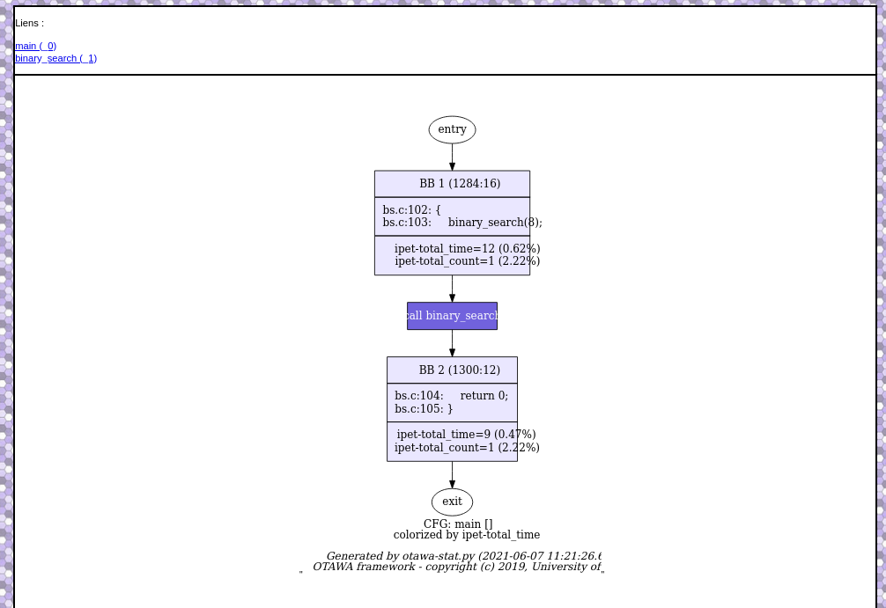

# Récupérer un graphe de flot (cfg)

Retourne le cfg en fichier `.dot` de {$id_cfg} correspondant à une fonction. Si non indiqué, renvoi celui du `main`. Avec le paramètre color_by, on peut indiquer si on veut que le cfg soit colorié selon le nombre de passages (`count`, valeur par défaut) ou le temps passé (`time`).




[TOC]

## Requête

**Méthode** : `Get`

```http
http://127.0.0.1:8000/stats/cfg/{$id_cfg}
```


## Paramètres

### Path

| Paramètre | Type   | Requis | Description                |
| --------- | ------ | ------ | -------------------------- |
| id_cfg    | string | True   | Identifiant du cfg demandé |

### Query

| Paramètre  | Type   | Requis | Valeurs                | Description                                                  |
| ---------- | ------ | ------ | ---------------------- | ------------------------------------------------------------ |
| colored_by | string | False  | count (default) / time | Choix indiquant si le cfg sera colorié en fonction des stictiques du temps d'exécution ou du nombre d'exécution |


## Réponse 

- Succès

| Code     | Content-Type                     | Body                                                         |
| -------- | -------------------------------- | ------------------------------------------------------------ |
| `200 Ok` | `application/dot; charset=utf-8` | Description du graphe de flot en fichier `.dot` (Pour plus d'information sur ce type de fichier, renseigné vous sur [GraphViz](https://graphviz.org/)) |


## Exemple

***Requête***

```http
http://127.0.0.1:8000/stats/cfg/_1?colored_by=time
```

**Résultat**

- Code : `200 OK`
- Content-type : `application/dot; charset=utf-8`
- Body :   

```
  digraph _1 {
	_1_0 [label="entry"];
	_1_1 [margin=0,shape="box",label=<<table border='0' cellpadding='8px'><tr><td>BB 1 (1064:44)</td></tr><hr/><tr><td align='left'>bs.c:78: {
<br align='left'/>bs.c:81: &nbsp;&nbsp;low&nbsp;=&nbsp;0;
<br align='left'/>bs.c:82: &nbsp;&nbsp;up&nbsp;=&nbsp;14;
<br align='left'/>bs.c:83: &nbsp;&nbsp;fvalue&nbsp;=&nbsp;-1&nbsp;/*&nbsp;all&nbsp;data&nbsp;are&nbsp;positive&nbsp;*/&nbsp;;
<br align='left'/>bs.c:84: &nbsp;&nbsp;while&nbsp;(low&nbsp;&amp;lt;=&nbsp;up)&nbsp;{
<br align='left'/></td></tr><hr/><tr><td>ipet-total_time=58 (3.02%)<br/>ipet-total_count=1 (2.22%)<br/></td></tr></table>>,fillcolor="#d6cfff",style="filled",fontcolor="#000000"];
	_1_2 [margin=0,shape="box",label=<<table border='0' cellpadding='8px'><tr><td>BB 2 (1244:16)</td></tr><hr/><tr><td align='left'>bs.c:84: &nbsp;&nbsp;while&nbsp;(low&nbsp;&amp;lt;=&nbsp;up)&nbsp;{
<br align='left'/></td></tr><hr/><tr><td>ipet-total_time=297 (15.46%)<br/>ipet-total_count=11 (24.44%)<br/></td></tr></table>>,fillcolor="#ab9eff",style="filled",fontcolor="#000000"];
	_1_3 [margin=0,shape="box",label=<<table border='0' cellpadding='8px'><tr><td>BB 3 (1108:44)</td></tr><hr/><tr><td align='left'>bs.c:85: &nbsp;&nbsp;&nbsp;&nbsp;mid&nbsp;=&nbsp;(low&nbsp;+&nbsp;up)&nbsp;&amp;gt;&amp;gt;&nbsp;1;
<br align='left'/>bs.c:86: &nbsp;&nbsp;&nbsp;&nbsp;if&nbsp;(&nbsp;data[mid].key&nbsp;==&nbsp;x&nbsp;)&nbsp;{&nbsp;&nbsp;/*&nbsp;&nbsp;found&nbsp;&nbsp;*/
<br align='left'/></td></tr><hr/><tr><td>ipet-total_time=820 (42.69%)<br/>ipet-total_count=10 (22.22%)<br/></td></tr></table>>,fillcolor="#7162dd",style="filled",fontcolor="#ffffff"];
	_1_4 [margin=0,shape="box",label=<<table border='0' cellpadding='8px'><tr><td>BB 4 (1192:24)</td></tr><hr/><tr><td align='left'>bs.c:91: &nbsp;&nbsp;&nbsp;&nbsp;&nbsp;&nbsp;if&nbsp;(&nbsp;data[mid].key&nbsp;&amp;gt;&nbsp;x&nbsp;)&nbsp;&nbsp;&nbsp;&nbsp;&nbsp;{
<br align='left'/></td></tr><hr/><tr><td>ipet-total_time=480 (24.99%)<br/>ipet-total_count=10 (22.22%)<br/></td></tr></table>>,fillcolor="#9b8ef5",style="filled",fontcolor="#ffffff"];
	_1_5 [margin=0,shape="box",label=<<table border='0' cellpadding='8px'><tr><td>BB 5 (1232:12)</td></tr><hr/><tr><td align='left'>bs.c:95: &nbsp;&nbsp;&nbsp;&nbsp;&nbsp;&nbsp;&nbsp;&nbsp;&nbsp;&nbsp;&nbsp;&nbsp;&nbsp;&nbsp;&nbsp;&nbsp;&nbsp;low&nbsp;=&nbsp;mid&nbsp;+&nbsp;1;
<br align='left'/></td></tr><hr/><tr><td>ipet-total_time=0 (0.00%)<br/>ipet-total_count=0 (0.00%)<br/></td></tr></table>>];
	_1_6 [margin=0,shape="box",label=<<table border='0' cellpadding='8px'><tr><td>BB 6 (1216:16)</td></tr><hr/><tr><td align='left'>bs.c:92: &nbsp;&nbsp;&nbsp;&nbsp;up&nbsp;=&nbsp;mid&nbsp;-&nbsp;1;
<br align='left'/></td></tr><hr/><tr><td>ipet-total_time=220 (11.45%)<br/>ipet-total_count=10 (22.22%)<br/></td></tr></table>>,fillcolor="#c0b7ff",style="filled",fontcolor="#000000"];
	_1_7 [margin=0,shape="box",label=<<table border='0' cellpadding='8px'><tr><td>BB 7 (1152:40)</td></tr><hr/><tr><td align='left'>bs.c:87: &nbsp;&nbsp;&nbsp;&nbsp;&nbsp;&nbsp;up&nbsp;=&nbsp;low&nbsp;-&nbsp;1;
<br align='left'/>bs.c:88: &nbsp;&nbsp;&nbsp;&nbsp;&nbsp;&nbsp;fvalue&nbsp;=&nbsp;data[mid].value;
<br align='left'/></td></tr><hr/><tr><td>ipet-total_time=0 (0.00%)<br/>ipet-total_count=0 (0.00%)<br/></td></tr></table>>];
	_1_8 [margin=0,shape="box",label=<<table border='0' cellpadding='8px'><tr><td>BB 8 (1260:20)</td></tr><hr/><tr><td align='left'>bs.c:98: &nbsp;&nbsp;return&nbsp;fvalue;
<br align='left'/>bs.c:99: }
<br align='left'/></td></tr><hr/><tr><td>ipet-total_time=25 (1.30%)<br/>ipet-total_count=1 (2.22%)<br/></td></tr></table>>,fillcolor="#eae7ff",style="filled",fontcolor="#000000"];
	_1_9 [label="exit"];
	_1_0 -> _1_1;
	_1_1 -> _1_2;
	_1_2 -> _1_3;
	_1_2 -> _1_8;
	_1_3 -> _1_4;
	_1_3 -> _1_7;
	_1_4 -> _1_5;
	_1_4 -> _1_6;
	_1_5 -> _1_2;
	_1_6 -> _1_2;
	_1_7 -> _1_2;
	_1_8 -> _1_9;
label=<CFG: binary_search [FUN(00000504), CALL(00000510)]<br/>colorized by ipet-total_time<br/><BR/><I>Generated by otawa-stat.py (2021-06-04 12:05:44.474145).</I><BR/><I>OTAWA framework - copyright (c) 2019, University of Toulouse</I>>;
}
```

